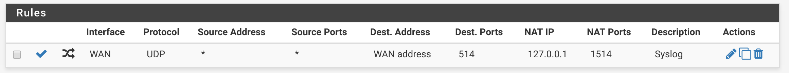

# Minion meets pfSense

## Overview

This repository contains instructions for installing OpenNMS Minion packages on a pfSense firewall.
The source code for the packages is maintained in a fork of pfSense's FreeBSD port tree: https://github.com/opennms-forge/FreeBSD-ports.

## Requirements

* pfSense 2.4.0-RELEASE (tested on a Netgate SG-2220 w/ 60GB SSD)
* OpenNMS Horizon 22.0.0

> The packages provided may also work with more recent versions of OpenNMS and pfSense

## Setup

> The following instructions require access to the pfSense shell.

Add the package repository, by creating `/usr/local/etc/pkg/repos/minion.conf` with:

```
minion: {
    url: "http://minionrepo.opennms.com/packages/freebsd_11-1x64-RELENG_2_4_0_MINION/",
    mirror_type: "http",
    signature_type: "pubkey",
    pubkey: "/usr/local/etc/ssl/minionrepo.cert",
    enabled: yes
}
```

Create `/usr/local/etc/ssl/minionrepo.cert` with:
```
-----BEGIN PUBLIC KEY-----
MIICIjANBgkqhkiG9w0BAQEFAAOCAg8AMIICCgKCAgEAn7e908vM9PK7vIkeiaZO
FphFUFYUv/Ozv3luZzJv6e8MtApRs1JrtOP3UFVhaIjKdxOiBeFOgymabLqBNhFd
Iz4SLO0nyKxATltwyLrF+lqDzr8rvZBOmKuEvk6ij4WWbMCvRK8+1gxAHlg75HTb
ARQ3uiQw8rATJcaFL7tHJmNWFRod7I3+NbHF/0gXnsZoWhbX9tlU6lFMFpplsO1O
QXt9iq/ygS6yQ3YjQhaiKYl2CVY5xowdHQyBZy0p9IGz5CF3LzNmZ5Xtya+poVv7
Ylg5J7kHJaMcVcmhaRIIV7859y3RIa4UORXE37wO+iCVaYTh2CPz72QurMWNNOke
ltXS9FShcYWeRhbBu/r481D79bwfaLLGNXN07QS64x+GBNs3lyVFm+Sk00vWso4k
JDOJk3Ap3Xp3hPl7UH+eitgkwvRMICLlqrVCbDbjzxmpCx/H6XNAHcaWUquxdLxC
c0/uSqBaGay6ZtuERixj0b1RP3xGZ9rqskVntmrbkwI1SC0oxxRMQBvstgDbL8pZ
lgVvDVY/3WhsuWfizdpsVmxsf0V8DjNVsTXbNSCO0rK5o3QI0go4dMLTVzVhHfX7
c0R7R/k+YdEzWkBJPbi7a1dx8MkvPNK0bfhUPC+ocjPY8srtgrn6QTNoCtW97h/6
bnvp7RibR+H08f4lSZV0b0cCAwEAAQ==
-----END PUBLIC KEY-----
```

Update the package repository:

```sh
pkg update
```


Install the Minion package using the Web UI, or directly in the command line using:

```
pkg install pfSense-pkg-minion
```

## Configure your Minion

Once the package has been installed, you can access the **Minion** option in **Services** menu to configure the service.

Enable the service, and point it to your OpenNMS instance:

| Field      | Example value                 |
| -----------|:-----------------------------:|
| HTTP URL   | http://opennms:8980/opennms   |
| Broker URL | failover:tcp://opennms:61616  |
| Location   | HOME                          |

Enter the username and password for an existing user assocated with the MINION role.

Save the configuration.

Navigate to to **Services** under the **Status** menu and start the Minion service.

## Verify your Minion

Login to the Karaf shell from the pfSense shell using:

```sh
ssh -oPort=8201 admin@127.0.0.1
```

> The default username and password to the Karaf shell is admin/admin


Verify that the backend is reachable by running:

```sh
minion:ping
```

If communication was successful, you should see output similar to:

```sh
admin@minion>minion:ping
Connecting to ReST...
OK
Connecting to Broker...
OK
admin@minion>
```

Now reboot the appliance, and verify that the service is restarted on reboot, and that all of the checks above still pass.

Congratulations, you're ready to go.

## Configuring Syslog

By default, the Syslog listener in the Minion container will listen on port 1514.

### Accept messages from other devices

To accept Syslog messages on port 514, you can setup a NAT rule that looks like:



### Forward messages from the pfSense appliance

If you're interested in monitoring the pfSense appliance, you can forward its log message to the Minion.

Navigate to `Status -> System Logs -> Settings`

Check `Send log messages to remote syslog server`

Enter `127.0.0.1:1514` as a `Remote Log Server`.

## Known Issues

* The packages should be relocated under the `net-mgmt` tree instead of `net`


## SSL

Add your certifcate chain to the default trust store using:

```sh
/usr/local/openjdk8/bin/keytool -trustcacerts -keystore /usr/local/openjdk8/jre/lib/security/cacerts -storepass changeit -noprompt -importcert -file chain.pem
```

